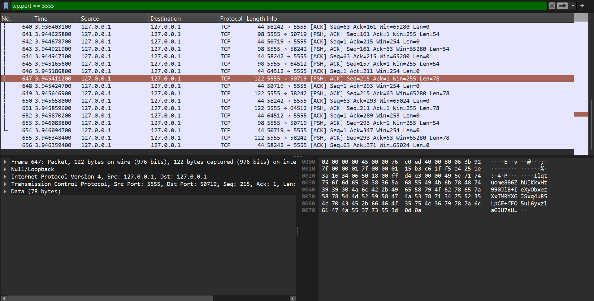

# Apartado 4. Capturas de Wireshark con tráfico no legible (CIFRADO)

Tras activar el cifrado (implementación de `CryptoUtil`), una nueva captura de Wireshark debe mostrar que el contenido ya **no se entiende como texto plano** sino como datos binarios/Base64 opacos.

## Instalación de Wireshark

### Windows

1. Descarga el instalador desde https://www.wireshark.org/download.html (Windows Installer msi/exe).
2. Ejecuta el instalador con permisos de administrador.
3. Sigue el asistente de instalación; **acepta instalar Npcap** (driver de captura de paquetes).
4. Reinicia tu máquina si el instalador lo solicita.
5. Abre Wireshark desde el menú Inicio o línea de comandos: `wireshark.exe`.

### Linux (Ubuntu/Debian)

```bash
sudo apt update && sudo apt install -y wireshark
# Opcional: permitir captura sin sudo
sudo usermod -aG wireshark $(whoami)
# Luego inicia sesión de nuevo o usa: wireshark
```

### macOS

```bash
brew install --cask wireshark
# O descarga el DMG desde https://www.wireshark.org/download.html
```

---

## Pasos para capturar tráfico cifrado (Windows)

### 1. **Abre Wireshark como administrador**

- Click derecho en el icono de Wireshark → "Ejecutar como administrador".
- Aparecerá la pantalla de selección de interfaz.

### 2. **Selecciona la interfaz de red correcta**

- Si tu servidor y cliente corren en **la misma máquina (localhost)**:
  - Selecciona **Loopback** (interfaz local).
- Si están en máquinas diferentes en red local:
  - Selecciona **Ethernet** o **Wi-Fi** según tu conexión.
- Puedes ver el tráfico de todas las interfaces si haces clic en "Start".

### 3. **Configura el filtro de captura (Capture Filter)**

- En la pantalla de interfaces, puedes escribir en el campo "Capture Filter" (arriba del listado).
- Escribe el filtro **por puerto**:
  ```
  tcp port 5555
  ```
  (asume que tu aplicación usa puerto 5555; cambia si usas otro).
- O deja vacío para capturar todo y filtra después en la vista.

### 4. **Inicia la captura**

- Haz clic en el botón azul **"Start"** (interfaz seleccionada).
- Aparecerá la pantalla de captura en vivo con un listado vacío (en espera de paquetes).

### 5. **Inicia tu servidor y cliente** (en otra ventana/terminal)

- Terminal 1 (Servidor):
  ```bash
  cd c:\Users\edugo\OneDrive\Documentos\pgv\PGV-ImpostorGame
  mvn -q exec:java@server
  ```
- Terminal 2+ (Cliente):
  ```bash
  mvn -q exec:java@client
  ```
- Escribe en el cliente: `JOIN|nombre` (o la secuencia deseada).
- Wireshark comenzará a capturar paquetes en tiempo real.

### 6. **Captura un intercambio completo**

- Envía al menos:
  1.  Un mensaje `JOIN|jugador1` desde cliente.
  2.  Espera respuesta del servidor.
  3.  Envía una palabra o comando adicional.
- Déjalo capturar durante 10–20 segundos para asegurar que hay tráfico suficiente.


---

## Visualización de tráfico cifrado

### Aplica un filtro en la vista (Display Filter)

- En el campo "Filter" (debajo de la barra de herramientas), escribe:
  ```
  tcp.port == 5555
  ```
- Presiona **Enter**. Solo aparecerán paquetes TCP del puerto 5555.

### Inspecciona los paquetes

1. **Haz clic en un paquete TCP** de datos (Data o PSH flag).
2. En el panel inferior ("Packet Details"), expande:
   - `TCP` → `[Segment Data]` o directamente mira `Data` (raw hex).
3. En el panel más abajo ("Packet Bytes"), verás:
   - **Hex View**: contenido en hexadecimal (debería verse como datos opacos).
   - **ASCII/UTF-8**: intentará decodificar como texto; verás caracteres ilegibles o símbolos extraños.
   - **Base64** (si buscas en la línea): debería verse como texto Base64 de la forma `IV+ciphertext_base64`.

### Qué esperas ver

- **Antes del cifrado** (`01-wireshark-trafico.md`): `JOIN|nombre`, `WORD|palabra`, etc., en texto plano.
- **Después del cifrado** (este documento): `K7f9XqL2m...` (Base64 de IV+ciphertext), completamente ilegible.

---

## Comparación lado a lado (Plaintext vs. Encrypted)

### Ejemplo: paquete de `JOIN|jugador1` sin cifrar

```
... [TCP Data]
JOIN|jugador1
```

### Ejemplo: paquete de `JOIN|jugador1` con cifrar

```
... [TCP Data]
SqPgL2Xk9RfFmN0kB5jQw1aYm2pL8qZ3...
(IV de 12 bytes en hexadecimal + ciphertext AES/GCM en Base64, total ~44–60 caracteres)
```

---

## Guardar y exportar la captura

### Guardar como archivo .pcap

1. **File** → **Save As…**
2. Nombre el archivo: `encrypted-traffic.pcap` o similar.
3. Elige la ubicación (p. ej., carpeta `docs/evidence/` de tu proyecto).
4. Haz clic **Save**.

### Exportar pantallazo

1. Selecciona los paquetes de interés (Ctrl+Click para múltiples).
2. **File** → **Export Packet Dissections** → **As PDF** (o CSV/JSON).
3. O simplemente captura una pantalla (Screenshot) mostrando:
   - Filtro aplicado (`tcp.port == 5555`).
   - Listado de paquetes con timestamps.
   - Un paquete expandido donde se vea el payload Base64/opaco.

---

## Evidencias requeridas para esta práctica

Incluye en tu entrega (commits a `develop`):

1. **Al menos una captura (pantallazo)** mostrando:
   - Wireshark con filtro `tcp.port == 5555` activo.
   - Múltiples paquetes TCP capturados.
   - Un paquete "Data" expandido en el panel de detalles, donde se vea el payload **ilegible/cifrado**.

2. **Archivo `.pcap`** guardado (p. ej., `docs/evidence/encrypted-traffic.pcap`):
   - Prueba de captura en bruto, importable en Wireshark para auditoría.

3. **Comparación visual** (pantallazo de plaintext vs. ciphertext, o tabla en doc):
   - Muestra claramente la diferencia entre el apartado 1 (legible) y apartado 4 (opaco).

---

## Validación

- ✅ Wireshark abierto y ejecutándose en Windows/Linux/macOS.
- ✅ Filtro por puerto 5555 aplicado.
- ✅ Tráfico cifrado capturado (payload no es JSON/texto plano obvio).
- ✅ Capturas guardadas y añadidas a la rama `develop`.
- ✅ Commit realizado: `docs: add encrypted wireshark evidence`.

